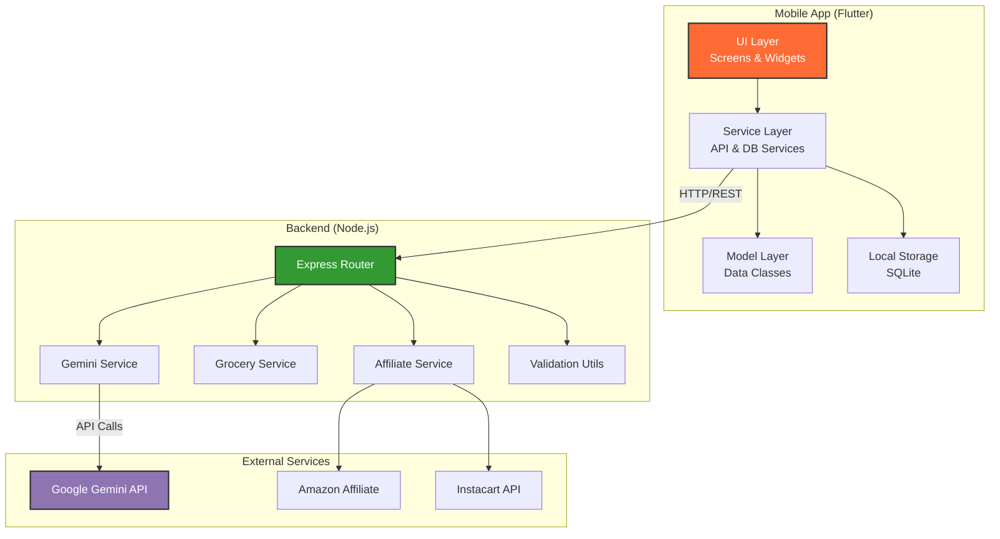

<div align="center">


[](https://flutter.dev)
[](https://nodejs.org)
[](https://ai.google.dev)
[](https://expressjs.com)
[](https://www.sqlite.org)
[](LICENSE)

### 🍳 Transform Saved Recipes into Actionable Cooking Workflows

**AI-Powered Recipe Extraction • Smart Grocery Lists • Intelligent Pantry Management**

[Features](#-features) • [Demo](#-demo) • [Quick Start](#-quick-start) • [Tech Stack](#️-tech-stack) • [API](#-api-documentation) • [Roadmap](#-roadmap)

</div>

---

## 🎯 What is CookFlow?

CookFlow is an **execution-focused cooking companion** that bridges the gap between recipe discovery and actual cooking. Unlike traditional recipe apps, CookFlow focuses on turning your saved recipes into structured, actionable workflows.

<div align="center">


</div>

> 💡 **Philosophy:** Not a recipe browsing app — CookFlow transforms your saved recipes into real cooking action.

---

## 🎬 Demo

<div align="center">

### 📱 App In Action

> **Note:** Add screenshots here showcasing:
> - Recipe extraction interface
> - Beautiful recipe card display
> - Smart grocery list generation
> - Pantry management screen

</div>

---

## ✨ Features

<table>
<tr>
<td width="50%" valign="top">

### 🤖 **Phase 1** - AI Extraction
<br>

**Intelligent Recipe Processing**
- 🧠 **Smart Parsing** powered by Google Gemini 1.5 Flash
- 📊 **Structured Output** (title, servings, ingredients, steps, difficulty, cuisine, tags)
- ⏱️ **Time Estimation** (prep time & cook time)
- 🎯 **Quality Scoring** with validation
- 🔄 **Robust Error Handling** with 30s timeout & retry logic

**Beautiful User Experience**
- 🎨 **Material 3 Design** with warm, food-inspired aesthetics
- 📱 **Mobile-First** Flutter app for iOS & Android
- 🌓 **Dark Mode Support** (coming soon)
- ⚡ **Smooth Animations** & loading states

</td>
<td width="50%" valign="top">

### 🛒 **Phase 2** - Shopping & Pantry
<br>

**Smart Grocery Management**
- 🤖 **AI-Powered Categorization** (produce, dairy, meat, etc.)
- 🔗 **Affiliate Integration** for Amazon & Instacart
- ✅ **Interactive Checklists** with real-time updates
- 📤 **Share & Export** functionality

**Intelligent Pantry**
- 💾 **Local SQLite Storage** for offline access
- ⚠️ **Expiry Warnings** to reduce food waste
- 🔍 **Search & Filter** capabilities
- 📊 **Inventory Tracking**

**Seamless Navigation**
- 📍 **Bottom Navigation** for quick access
- 🎯 **Context-Aware UI** elements

</td>
</tr>
</table>

---

## 🛠️ Tech Stack

<div align="center">

### Architecture Overview

| Layer | Technology | Purpose | Why? |
|:------|:-----------|:--------|:-----|
| 📱 **Mobile** | Flutter (Dart) | Cross-platform native app | Single codebase, native performance |
| ⚙️ **Backend** | Node.js + Express | REST API server | Fast, scalable, JavaScript ecosystem |
| 💾 **Database** | SQLite | Local pantry storage | Lightweight, embedded, offline-first |
| 🤖 **AI Engine** | Google Gemini 1.5 Flash | Recipe extraction & categorization | State-of-the-art NLP, multimodal capabilities |
| 💳 **Monetization** | RevenueCat (Phase 3) | Subscription management | Cross-platform, analytics included |
| 🔗 **Affiliate** | Custom Integration | Amazon/Instacart links | Revenue optimization |

### Key Dependencies

**Backend:**
- `express` - Web framework
- `@google/generative-ai` - Gemini AI SDK
- `dotenv` - Environment configuration
- `cors` - Cross-origin resource sharing

**Frontend (Flutter):**
- `http` - API communication
- `sqflite` - Local database
- `provider` - State management
- `share_plus` - Share functionality
- `url_launcher` - External links

</div>

---

## 🚀 Quick Start

### Prerequisites

Ensure you have the following installed:

```bash
✓ Node.js 16+ and npm
✓ Flutter SDK 3.0+
✓ Google Gemini API Key (get it from https://ai.google.dev)
✓ iOS Simulator or Android Emulator (or physical device)
```

### 1️⃣ **Backend Setup**

```bash
# Navigate to backend directory
cd backend

# Install dependencies
npm install

# Configure environment
cp .env.example .env

# Edit .env and add your Gemini API key:
# GEMINI_API_KEY=your_api_key_here
# PORT=3000

# Start the server
npm start

# ✅ Server should be running on http://localhost:3000
```

### 2️⃣ **Flutter App Setup**

```bash
# Navigate to app directory
cd cookflow_app

# Install dependencies
flutter pub get

# Configure API endpoint (lib/services/api_service.dart)
# - Android Emulator: http://10.0.2.2:3000
# - iOS Simulator: http://localhost:3000
# - Physical Device: http://YOUR_COMPUTER_IP:3000

# Run the app
flutter run

# Or specify a device
flutter run -d chrome    # Web
flutter run -d android   # Android
flutter run -d ios       # iOS
```

### 3️⃣ **Verify Installation**

Test the backend API:

```bash
curl -X POST http://localhost:3000/extract-recipe \
  -H "Content-Type: application/json" \
  -d '{
    "raw_text": "Preheat oven to 350°F. Mix 2 cups flour, 1 cup butter, 1 cup sugar. Bake for 12 minutes."
  }'
```

Expected response:
```json
{
  "success": true,
  "data": {
    "title": "Simple Cookies",
    "servings": "...",
    "ingredients": [...],
    "steps": [...]
  }
}
```

---

## 🎨 Design Philosophy

<div align="center">

### 🎨 Color Palette

```
🧡 Primary:     #FF6B35  (Vibrant Orange - Energy & Appetite)
💚 Accent:      #4CAF50  (Fresh Green - Health & Freshness)
🤍 Background:  #FAFAFA  (Soft White - Clean & Minimal)
🖤 Text:        #212121  (Rich Black - Readability)
🌫️ Surface:     #FFFFFF  (Pure White - Card Backgrounds)
```

### 📐 Design Principles

<table>
<tr>
<td width="50%">

**✅ DO**
- Use generous spacing (16-24px)
- Apply rounded corners (8-16px radius)
- Implement soft shadows for depth
- Maintain strong typography hierarchy
- Add smooth loading states
- Show meaningful error messages
- Use food-inspired imagery

</td>
<td width="50%">

**❌ DON'T**
- Use default Flutter widgets without styling
- Leave debug banners visible
- Stack too many colors
- Use harsh animations
- Hide error states
- Compromise on accessibility
- Overcrowd the UI

</td>
</tr>
</table>

**Core Values:** Modern Minimal • Food-Inspired • Generous Spacing • Production-Grade

</div>

---

## 🎯 API Documentation

### 🔌 Base URL
```
http://localhost:3000
```

### 📍 Endpoints

#### 1. Extract Recipe

Extract structured data from raw recipe text.

```http
POST /extract-recipe
Content-Type: application/json
```

**Request Body:**
```json
{
  "raw_text": "Recipe text (minimum 50 characters)..."
}
```

**Success Response (200 OK):**
```json
{
  "success": true,
  "data": {
    "title": "Chocolate Chip Cookies",
    "servings": "24 cookies",
    "prepTime": "15 minutes",
    "cookTime": "12 minutes",
    "difficulty": "Easy",
    "cuisine": "American",
    "tags": ["dessert", "baking"],
    "ingredients": [
      {
        "quantity": "2 cups",
        "item": "all-purpose flour"
      },
      {
        "quantity": "1 cup",
        "item": "butter, softened"
      }
    ],
    "steps": [
      "Preheat oven to 350°F (175°C)",
      "Mix butter and sugar until creamy",
      "Add eggs and vanilla",
      "Combine dry ingredients",
      "Bake for 10-12 minutes"
    ],
    "qualityScore": 0.95
  }
}
```

**Error Response (400/500):**
```json
{
  "success": false,
  "error": "Error message here"
}
```

#### 2. Generate Grocery List

Generate categorized grocery list from ingredients.

```http
POST /generate-grocery-list
Content-Type: application/json
```

**Request Body:**
```json
{
  "ingredients": [
    { "quantity": "2 cups", "item": "flour" },
    { "quantity": "1 lb", "item": "chicken breast" }
  ]
}
```

**Response:**
```json
{
  "success": true,
  "categories": {
    "Baking": ["2 cups flour"],
    "Meat & Seafood": ["1 lb chicken breast"]
  }
}
```

#### 3. Get Affiliate Links

Get shopping links with affiliate tracking.

```http
POST /get-affiliate-links
Content-Type: application/json
```

**Request Body:**
```json
{
  "items": ["flour", "chicken breast"]
}
```

**Response:**
```json
{
  "success": true,
  "links": [
    {
      "item": "flour",
      "amazon": "https://amzn.to/...",
      "instacart": "https://instacart.com/..."
    }
  ]
}
```

---

## 📋 Roadmap

<div align="center">

| Phase | Status | Timeline | Features | Priority |
|:------|:-------|:---------|:---------|:---------|
| **Phase 1** | ✅ Complete | Q4 2025 | Recipe extraction, Beautiful UI, JSON display, Time estimation | **HIGH** |
| **Phase 2** | ✅ Complete | Q1 2026 | Grocery lists, Pantry tracking, Affiliate links, Categorization | **HIGH** |
| **Phase 3** | 🚧 In Progress | Q2 2026 | Subscriptions (RevenueCat), Cloud sync (Firebase), Meal planning | **MEDIUM** |
| **Phase 4** | 📅 Planned | Q3 2026 | Social features, Recipe sharing, Community, Nutrition tracking | **LOW** |
| **Phase 5** | 💭 Future | Q4 2026 | Voice commands, AR cooking assistant, Smart device integration | **NICE-TO-HAVE** |

</div>

---

## 📁 Project Structure

```
cookflow/
├── 📱 cookflow_app/              # Flutter Mobile Application
│   ├── lib/
│   │   ├── main.dart            # App entry point
│   │   ├── screens/             # UI Screens
│   │   │   ├── extraction_screen.dart
│   │   │   ├── grocery_list_screen.dart
│   │   │   └── pantry_screen.dart
│   │   ├── services/            # Business Logic
│   │   │   ├── api_service.dart
│   │   │   └── database_service.dart
│   │   ├── models/              # Data Models
│   │   │   ├── recipe.dart
│   │   │   └── grocery_item.dart
│   │   └── widgets/             # Reusable Components
│   │       ├── recipe_card.dart
│   │       └── loading_indicator.dart
│   ├── pubspec.yaml             # Flutter dependencies
│   └── android/ios/             # Platform-specific code
│
├── ⚙️ backend/                   # Node.js + Express API
│   ├── server.js                # Server entry point
│   ├── routes/                  # API Routes
│   │   ├── extraction.js
│   │   ├── grocery.js
│   │   └── affiliate.js
│   ├── services/                # Core Services
│   │   ├── gemini_service.js    # AI integration
│   │   ├── grocery_service.js   # Categorization
│   │   └── affiliate_service.js # Link generation
│   ├── utils/                   # Utilities
│   │   └── validation.js        # JSON schema validation
│   ├── package.json             # Node dependencies
│   └── .env.example             # Environment template
│
├── 📄 Documentation
│   ├── README.md                # This file
│   ├── FIREBASE_SETUP.md        # Firebase configuration
│   └── RECIPE_EXTRACTION_IMPROVEMENTS.md
│
└── 🔧 Configuration
    ├── .gitignore
    └── LICENSE
```

---

## 🧪 Testing

### Backend Testing

<details>
<summary><b>🔧 Manual API Tests</b></summary>

**Test 1: Extract Recipe**
```bash
curl -X POST http://localhost:3000/extract-recipe \
  -H "Content-Type: application/json" \
  -d '{
    "raw_text": "Preheat oven to 350F. Mix 2 cups flour, 1 cup butter, 1 cup sugar. Beat 2 eggs. Bake for 12 minutes until golden."
  }'
```

**Test 2: Generate Grocery List**
```bash
curl -X POST http://localhost:3000/generate-grocery-list \
  -H "Content-Type: application/json" \
  -d '{
    "ingredients": [
      {"quantity": "2 cups", "item": "flour"},
      {"quantity": "1 lb", "item": "chicken"}
    ]
  }'
```

**Test 3: Health Check**
```bash
curl http://localhost:3000/health
```
</details>

<details>
<summary><b>📱 Mobile App Manual Testing</b></summary>

**Recipe Extraction Flow:**
1. Launch the app on emulator/device
2. Paste a recipe (text or URL)
3. Tap "Extract Recipe" button
4. Verify loading state appears
5. Check beautiful card display with:
   - Recipe title
   - Servings count
   - Prep & cook time
   - Ingredients list
   - Step-by-step instructions
6. Verify JSON viewer shows structured data

**Grocery List Flow:**
1. From extracted recipe, tap "Generate Grocery List"
2. Verify AI categorization (Produce, Dairy, etc.)
3. Check/uncheck items
4. Test "Share List" functionality
5. Verify persistence after app restart

**Pantry Flow:**
1. Navigate to Pantry tab
2. Add new item with expiry date
3. Test search functionality
4. Verify expiry warnings appear
5. Test item deletion
</details>

### Automated Testing (Coming Soon)

```bash
# Backend unit tests
cd backend
npm test

# Frontend widget tests
cd cookflow_app
flutter test

# Integration tests
flutter drive --target=test_driver/app.dart
```

---

## 🔧 Architecture

<div align="center">

### System Architecture



### Architecture Principles

**🏗️ Clean Architecture**
- Clear separation of concerns
- Dependency inversion
- Testable components

**🔒 Type Safety**
- TypeScript/Dart type checking
- JSON schema validation
- Runtime error handling

**🛡️ Defensive Coding**
- Input validation
- Error boundaries
- Graceful degradation

**🚀 Production Ready**
- Environment configuration
- Logging & monitoring
- Performance optimization

</div>

---

## 🤝 Contributing

We welcome contributions! Here's how you can help:

<details>
<summary><b>🐛 Report Bugs</b></summary>

Found a bug? Please open an issue with:
- Clear, descriptive title
- Steps to reproduce
- Expected vs actual behavior
- Screenshots if applicable
- Environment details (OS, Flutter version, etc.)
</details>

<details>
<summary><b>💡 Suggest Features</b></summary>

Have an idea? Open an issue with:
- Feature description
- Use case/motivation
- Proposed implementation (optional)
- UI/UX mockups (if applicable)
</details>

<details>
<summary><b>🔧 Submit Pull Requests</b></summary>

1. Fork the repository
2. Create a feature branch (`git checkout -b feature/amazing-feature`)
3. Commit your changes (`git commit -m 'Add amazing feature'`)
4. Push to the branch (`git push origin feature/amazing-feature`)
5. Open a Pull Request

**PR Guidelines:**
- Follow existing code style
- Add tests for new features
- Update documentation
- Keep PRs focused and atomic
</details>

---

## 💰 Monetization Strategy

<div align="center">

| Revenue Stream | Implementation | Status | Est. Revenue |
|:---------------|:---------------|:-------|:-------------|
| 🔑 **Premium Subscription** | RevenueCat + Stripe | 🚧 Phase 3 | $4.99/month |
| 🔗 **Affiliate Commissions** | Amazon Associates + Instacart | ✅ Active | 3-5% per order |
| 📊 **Analytics** | User behavior insights (anonymized) | 📅 Phase 4 | Data partnership |
| 🎯 **Sponsored Content** | Featured recipes from brands | 💭 Future | TBD |

**Target:** $10K MRR by Q4 2026

</div>

---

## 🐛 Troubleshooting

<details>
<summary><b>⚠️ Backend Issues</b></summary>

**Problem:** `GEMINI_API_KEY is not configured`
- **Solution:** Create `.env` file in `backend/` directory and add:
  ```
  GEMINI_API_KEY=your_actual_api_key
  PORT=3000
  ```

**Problem:** `Request timeout` or `Failed to generate recipe`
- **Solution 1:** Check Gemini API status at https://status.cloud.google.com
- **Solution 2:** Verify API key is valid
- **Solution 3:** Check network connectivity
- **Solution 4:** Increase timeout in `gemini_service.js`

**Problem:** `Port already in use`
- **Solution:** Change PORT in `.env` or kill process:
  ```bash
  # Windows
  netstat -ano | findstr :3000
  taskkill /PID <PID> /F
  
  # macOS/Linux
  lsof -ti:3000 | xargs kill
  ```
</details>

<details>
<summary><b>📱 Flutter Issues</b></summary>

**Problem:** `Failed to connect to backend`
- **Solution:** Update API URL in `lib/services/api_service.dart`:
  - Android Emulator: `http://10.0.2.2:3000`
  - iOS Simulator: `http://localhost:3000`
  - Physical Device: `http://YOUR_COMPUTER_IP:3000`

**Problem:** `Build errors` or dependency conflicts
- **Solution:**
  ```bash
  flutter clean
  flutter pub get
  flutter pub upgrade
  ```

**Problem:** `Database errors` in pantry
- **Solution:** Uninstall and reinstall app to reset SQLite database

**Problem:** iOS build fails
- **Solution:**
  ```bash
  cd ios
  pod install
  cd ..
  flutter build ios
  ```
</details>

<details>
<summary><b>🤖 AI/Gemini Issues</b></summary>

**Problem:** Poor extraction quality
- **Solution:** Ensure input text is at least 50 characters and contains clear recipe structure

**Problem:** API quota exceeded
- **Solution:** Gemini has generous free tier, but check usage at https://console.cloud.google.com

**Problem:** Incorrect categorization
- **Solution:** Improve prompts in `grocery_service.js` or retrain with feedback
</details>

---

## 📄 License

This project is licensed under the **MIT License** - see the [LICENSE](LICENSE) file for details.

```
MIT License

Copyright (c) 2026 CookFlow

Permission is hereby granted, free of charge, to any person obtaining a copy
of this software and associated documentation files...
```

---

## 🙏 Acknowledgments

- **Google Gemini AI** - Powering intelligent recipe extraction
- **Flutter Team** - Amazing cross-platform framework
- **Node.js Community** - Robust backend ecosystem
- **Open Source Contributors** - For inspiring this project

---

<div align="center">

### 🏆 Built for Creator Hackathon 2026

**Mission:** Create a real, monetizable application with beautiful UX — not just another template demo.

**Tech Philosophy:** AI-First • Mobile-Native • Production-Grade • User-Centric

---

### 📬 Contact & Support

**Questions?** Open an issue
**Feedback?** We'd love to hear from you!
**Commercial Use?** Email us

---

**Crafted with ❤️, AI, and a passion for great food**


</div>
