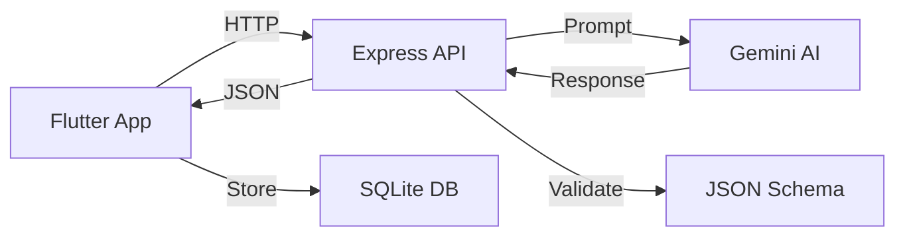

<div align="center">


[](https://flutter.dev)
[](https://nodejs.org)
[](https://ai.google.dev)
[](LICENSE)

**Transform saved recipes into actionable cooking workflows with AI-powered extraction**

[Features](#-features) • [Quick Start](#-quick-start) • [Tech Stack](#️-tech-stack) • [API Docs](#-api-documentation)

</div>

---

## 🎯 What is CookFlow?

An **execution-focused cooking app** that converts recipe links or text into structured, actionable cooking workflows.

```
Recipe Text → AI Extraction → Beautiful Display → Smart Grocery Lists → Cook! 🍳
```

> **Not a recipe browsing app** — CookFlow turns saved recipes into real cooking action.

---

## ✨ Features

<table>
<tr>
<td width="50%">

### 🤖 Phase 1 - AI Extraction
- **Smart Parsing** with Google Gemini 1.5 Flash
- **Structured Output** (title, servings, ingredients, steps)
- **Beautiful Material 3 UI** with warm, food-inspired design
- **Mobile-First** Flutter app for iOS & Android
- **Robust** with 30s timeout & retry logic

</td>
<td width="50%">

### 🛒 Phase 2 - Shopping & Pantry
- **Smart Grocery Lists** with AI categorization
- **Affiliate Links** for Amazon/Instacart
- **Pantry Tracking** with expiry warnings
- **Bottom Navigation** for seamless UX
- **Share & Export** grocery lists
- **Search & Filter** your pantry items

</td>
</tr>
</table>

---

## 🛠️ Tech Stack

<div align="center">

| Layer | Technology | Purpose |
|:------|:-----------|:--------|
| 📱 **Mobile** | Flutter (Dart) | Cross-platform native app |
| ⚙️ **Backend** | Node.js + Express | REST API server |
| 💾 **Database** | SQLite | Local pantry storage |
| 🤖 **AI** | Google Gemini 1.5 Flash | Recipe extraction & grocery categorization |
| 💳 **Payments** | RevenueCat (Phase 3) | Subscription management |

</div>

---

## 🚀 Quick Start

### Prerequisites
```bash
✓ Node.js 16+
✓ Flutter SDK 3.0+
✓ Google Gemini API Key
```

### 1️⃣ Backend Setup
```bash
cd backend
npm install
cp .env.example .env  # Add your GEMINI_API_KEY
npm start             # Server runs on http://localhost:3000
```

### 2️⃣ Flutter App Setup
```bash
cd cookflow_app
flutter pub get
flutter run

# Configure API endpoint in lib/services/api_service.dart:
# Android Emulator: http://10.0.2.2:3000
# iOS Simulator: http://localhost:3000
```

---

## 🎨 Design Philosophy

<div align="center">

### Color Palette
🧡 **Primary** `#FF6B35` • 💚 **Accent** `#4CAF50` • 🤍 **Background** `#FAFAFA`

### Principles
**Modern Minimal** • **Food-Inspired** • **Generous Spacing** • **Production-Grade**

✅ Rounded corners & soft shadows  
✅ Strong typography hierarchy  
✅ Smooth loading & error states  
❌ No debug UI or default widgets

</div>

---

## 🎯 API Documentation

### Extract Recipe API

```http
POST /extract-recipe
Content-Type: application/json
```

**Request Body:**
```json
{
  "raw_text": "Recipe text (minimum 50 characters)..."
}
```

**Response:**
```json
{
  "success": true,
  "data": {
    "title": "Chocolate Chip Cookies",
    "servings": "24 cookies",
    "ingredients": [
      { "quantity": "2 cups", "item": "all-purpose flour" }
    ],
    "steps": ["Preheat oven to 350°F", "Mix ingredients..."]
  }
}
```

---

## 📋 Roadmap

| Phase | Status | Features |
|:------|:-------|:---------|
| **Phase 1** | ✅ Complete | Recipe extraction, Beautiful UI, JSON display |
| **Phase 2** | ✅ Complete | Grocery lists, Pantry tracking, Affiliate links |
| **Phase 3** | 🚧 Planned | Subscriptions, Cloud sync, Meal planning |

---

## 📁 Project Structure

```
cookflow/
├── backend/                 # Node.js + Express API
│   ├── routes/             # API endpoints
│   ├── services/           # Gemini AI, Grocery, Affiliate
│   └── utils/              # JSON validation
│
└── cookflow_app/           # Flutter Mobile App
    ├── lib/
    │   ├── screens/        # Recipe, Grocery, Pantry
    │   ├── services/       # API client, SQLite DB
    │   └── widgets/        # Reusable components
    └── pubspec.yaml
```

---

## 🧪 Testing

<details>
<summary><b>Backend Test (CLI)</b></summary>

```bash
curl -X POST http://localhost:3000/extract-recipe \
  -H "Content-Type: application/json" \
  -d '{
    "raw_text": "Mix 2 cups flour, 1 cup butter, 1 cup sugar. Bake at 350F for 12 min."
  }'
```
</details>

<details>
<summary><b>Mobile App Test</b></summary>

1. Launch app on emulator/device
2. Paste example recipe
3. Tap "Extract Recipe"
4. Verify beautiful card display
5. Check structured data in JSON viewer
</details>

---

## 🔧 Architecture

<div align="center">



**Clean Architecture** • **Type-Safe** • **Defensive Coding** • **Production-Ready**

</div>

---

## 💰 Monetization

| Engine | Strategy | Platform |
|:-------|:---------|:---------|
| 🔑 **Subscription** | Premium features, unlimited imports, meal plans | RevenueCat |
| 🔗 **Affiliate** | Grocery purchase redirects (Amazon, Instacart) | Custom integration |

---

## 🐛 Troubleshooting

<details>
<summary><b>Backend Issues</b></summary>

- `GEMINI_API_KEY is not configured` → Add key to `.env`
- `Request timeout` → Check Gemini API status, retry request
</details>

<details>
<summary><b>Flutter Issues</b></summary>

- `Failed to connect` → Verify backend URL in `api_service.dart`
- Android emulator → Use `10.0.2.2:3000` not `localhost:3000`
- Build errors → Run `flutter clean && flutter pub get`
</details>

---

## 📄 License

Released under the [MIT License](LICENSE)

---

<div align="center">

### 🏆 Built For Creator Hackathon

**Goal:** Real, monetizable application with beautiful UX, not a template demo

---

**Made with ❤️ and AI**


</div>
